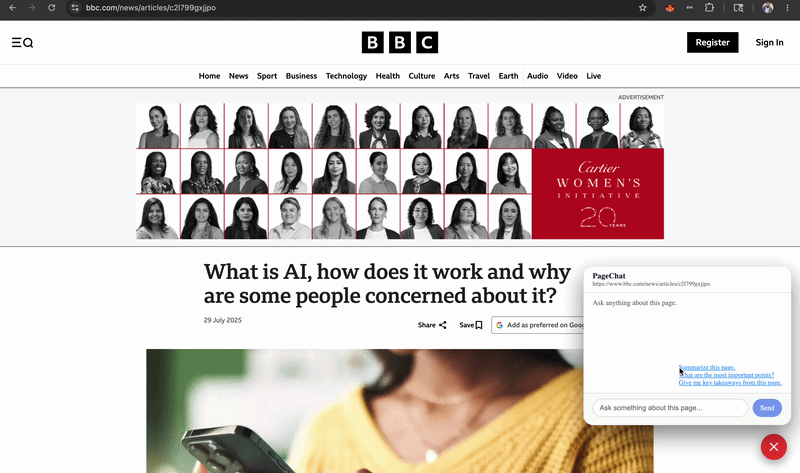

# PageChat



Chat with any web page using OpenAI. PageChat injects a chat panel into every page you visit — ask questions, get summaries, and extract key points instantly.

---

## Installation

1. Install the extension from the [Chrome Web Store](https://chromewebstore.google.com/detail/pagechat/clkgpcmjodnbcapllcihbnaflcjapini).
2. Click the PageChat panel that appears on any page.
3. Click **"Open options"** and enter your **OpenAI API key** (`sk-...`).
4. Start chatting.

Your API key is stored locally in your browser and never shared with anyone other than OpenAI.

---

## Features

- Ask anything about the current page
- Suggested prompts: Summarize, key points, takeaways
- Chat history saved per page
- Works across most websites

---

## Local development

### Backend

From `backend/`:

```bash
python3 -m venv .venv
source .venv/bin/activate
pip install -r requirements.txt
uvicorn app:app --reload
```

### Extension

From `extension/`:

```bash
npm install
npm run build
```

Then open `chrome://extensions`, enable **Developer mode**, click **Load unpacked**, and select `extension/dist/`.

